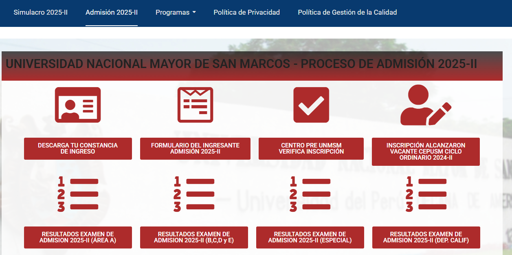
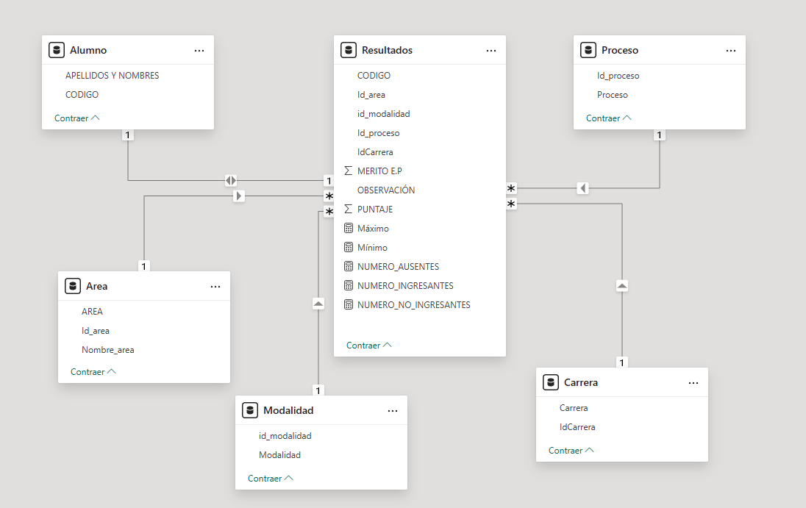
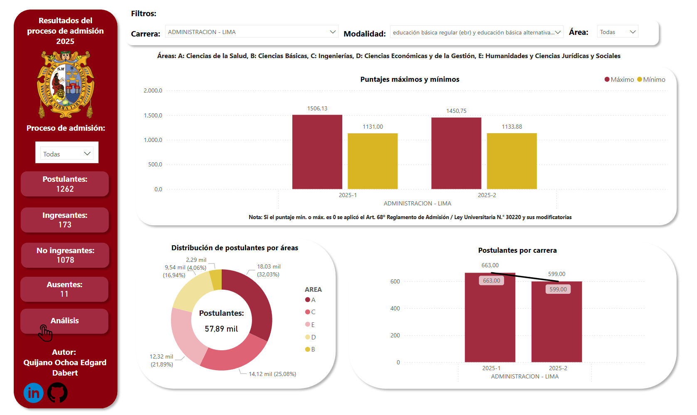
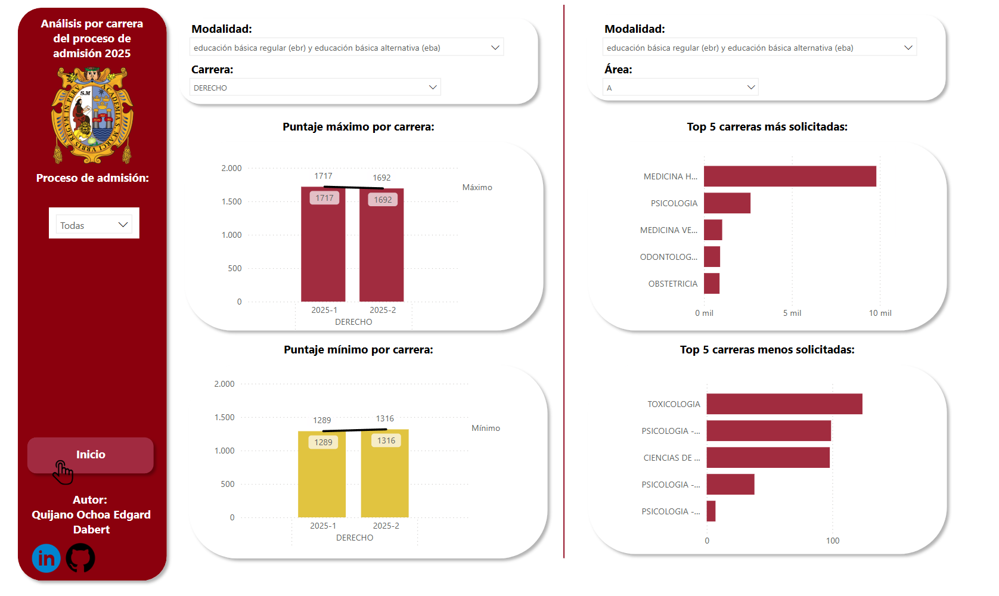

# Análisis del proceso de admisión 2025 a la UNMSM
## 🔗Links para cada proceso de admisión
Imágen de la página del proceso 2025-1

Link del [proceso de admisión 2025](https://admision.unmsm.edu.pe/Website20251/)

Imagen de la página del proceso 2025-2

Link del [proceso de admisión 2025](https://admision.unmsm.edu.pe/portal/admision2025-ii/)

# Modelo para el análisis de datos en Power BI
## 📊 Descripción del modelo
Este modelo de base de datos sigue un esquema en estrella, optimizado para consultas rápidas y eficientes en el análisis de resultados académicos. La estructura permite gestionar información relacionada con alumnos, áreas, modalidades de evaluación, procesos y carreras de manera centralizada.

## 📌 Justificación del Diseño
En el diseño en estrella se utilizó:

- Optimización para consultas: La tabla Resultados actúa como la tabla de hechos, permitiendo la agregación y análisis eficiente de puntajes, méritos, y estadísticas como número de ingresantes y ausentes.
- Estructura simple y comprensible: Las tablas dimensionales (Alumno, Área, Modalidad, Proceso y Carrera) almacenan información descriptiva que facilita la segmentación y categorización de los datos.
- Flexibilidad en reportes: Se pueden generar informes detallados sobre el desempeño de los alumnos según área, modalidad, proceso o carrera sin afectar el rendimiento de la base de datos.
- Facilidad de escalabilidad: Es sencillo agregar nuevas dimensiones o métricas sin alterar la estructura central.

## 📂 Tablas del Modelo
- Resultados (Tabla de hechos): Contiene métricas de evaluación como puntajes máximos y mínimos, número de ingresantes y ausentes, observaciones y mérito.
- Alumno: Almacena información de los estudiantes evaluados.
- Área: Define las diferentes áreas de evaluación.
- Modalidad: Especifica los tipos de modalidad de ingreso.
- Proceso: Representa el proceso en la que se evalúan los alumnos.
- Carrera: Define las carreras asociadas a los resultados.

## 📊 Visualización de Datos en Power BI  
  

  